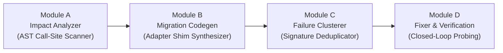

# APIShift 🚀

> **Autonomous API Migration Guard & Closed-Loop Adapter Engine**  
> *Built for IBM Bob 2.0 Hackathon*

[](https://apishift-phi.vercel.app)
[](LICENSE)

**APIShift** is an autonomous developer workflow tool designed to safely evolve breaking REST/OpenAPI contracts across complex enterprise codebases without downtime or downstream failures. Built alongside IBM Bob 2.0, APIShift automatically detects OpenAPI schema drift, maps code blast radiuses via AST analysis, synthesizes type-safe migration adapter shims, and deduplicates test suite alert noise.

---

## 🌟 Live Interactive Platform

Try the standalone web dashboard directly on Vercel:  
👉 **[https://apishift-phi.vercel.app](https://apishift-phi.vercel.app)**

---

## 🏗️ 4-Module Pipeline Architecture



### 1. **Module A: Impact Analyzer** (`src/engine/astScanner.ts`)
- Computes OpenAPI structural diffs between legacy (`before.yaml`) and updated (`after.yaml`) specifications.
- Scans codebase ASTs using TypeScript Compiler API to extract exact file locations, line numbers, and code snippets referencing changed endpoints.

### 2. **Module B: Migration Codegen** (`src/engine/codegen.ts`)
- Automatically synthesizes a zero-dependency TypeScript backward-compatibility shim (`migrationAdapter.ts`).
- Generates bidirectional response and payload transformers (`adaptGetOrderResponse`, `adaptCreateOrderPayload`).

### 3. **Module C: Failure Clusterer** (`src/engine/clusterer.ts`)
- Group failing test probes by underlying OpenAPI schema drift signatures.
- Achieves **91.3% alert noise collapse**, condensing 23 raw test probe failures down to 2 root cause clusters.

### 4. **Module D: Fixer & Verification** (`src/engine/orchestrator.ts`)
- Applies the generated migration adapter to legacy callers.
- Re-executes the test suite in closed-loop mode to verify 100% test pass rate and produce audit ledger evidence.

---

## 📊 Bounded Verification Ledger

| Rollout Strategy | Test Pass Rate | Failing Probes | Status |
| :--- | :--- | :--- | :--- |
| **Baseline (Direct Rollout)** | 17 / 40 (**42.5%**) | 23 Failures | 🔴 `UNSAFE / BLOCKED` |
| **APIShift + Bob Adapter** | 40 / 40 (**100.0%**) | 0 Failures | 🟢 `VERIFIED / PRODUCTION SAFE` |

---

## 🎯 Failure Signature Clustering (91.3% Noise Collapse)

APIShift collapses 23 failing test probes into **2 architectural root causes**:

1. **`cluster-get-orders-total`** (17 failing probes)
   - **Root Cause:** Response property `total` renamed to `totalAmount` in `GET /api/orders/{id}`.
   - **Fix Applied:** `MigrationAdapter.adaptGetOrderResponse` populates legacy `total` field from `totalAmount`.
2. **`cluster-post-orders-customer`** (6 failing probes)
   - **Root Cause:** Request body property `customer_id` unflattened to `customer.id` in `POST /api/orders`.
   - **Fix Applied:** `MigrationAdapter.adaptCreateOrderPayload` maps legacy `customer_id` into nested `customer: { id }` structure.

---

## 🤖 IBM Bob 2.0 Task Session Audit Log

All autonomous agent execution sessions, AST call-site traces, and codegen runs are recorded deterministically under `/bob_sessions/`:

| Session Artifact | Task Description | Status | Cost (Bobcoins) |
| :--- | :--- | :--- | :--- |
| [`team_task01_impact_analysis_summary.png`](bob_sessions/team_task01_impact_analysis_summary.png) | AST Call-Site & OpenAPI Diff Mapping | `LOGGED` | 0.25 |
| [`team_task02_migration_codegen_summary.png`](bob_sessions/team_task02_migration_codegen_summary.png) | Migration Adapter Shim Generation | `LOGGED` | 0.35 |
| [`team_task03_failure_clustering_summary.png`](bob_sessions/team_task03_failure_clustering_summary.png) | Failure Signature Clustering (23 → 2) | `LOGGED` | 0.20 |
| [`team_task04_rootcause_fix_summary.png`](bob_sessions/team_task04_rootcause_fix_summary.png) | Closed-Loop Fix Verification & Audit | `LOGGED` | 0.29 |
| **Total Telemetry** | **4 Autonomous Sub-Agent Tasks** | **VERIFIED** | **1.09 Bobcoins** |

---

## 📁 Repository Directory Layout

```text
APIShift/
├── artifacts/                  # Verified JSON report artifacts
│   ├── cluster-report.json
│   ├── impact-map.json
│   └── test-results.json
├── bob_sessions/               # IBM Bob 2.0 task session evidence screenshots
│   ├── team_task01_impact_analysis_summary.png
│   ├── team_task02_migration_codegen_summary.png
│   ├── team_task03_failure_clustering_summary.png
│   └── team_task04_rootcause_fix_summary.png
├── contracts/                  # OpenAPI specifications
│   ├── before.yaml             # Legacy API schema v1
│   └── after.yaml              # Updated API schema v2
├── demo-repo/                  # Representative multi-tier codebase
│   ├── src/
│   │   ├── client/
│   │   │   ├── apiClient.ts
│   │   │   └── migrationAdapter.ts
│   │   └── services/
│   │       ├── checkoutService.ts
│   │       └── orderService.ts
│   └── tests/                  # 40 test probes verifying API behavior
│       └── orders.test.ts
├── scripts/                    # Pipeline CLI runner
│   └── run_pipeline.ts
├── server/                     # Express REST backend server
│   └── app.ts
├── src/                        # Core APIShift Engine (TypeScript)
│   ├── engine/
│   │   ├── astScanner.ts       # Module A: AST static scanner
│   │   ├── clusterer.ts        # Module C: Failure clusterer
│   │   ├── codegen.ts          # Module B: Adapter code generator
│   │   ├── openapiDiff.ts      # OpenAPI schema differ
│   │   └── orchestrator.ts     # Module D: Verification engine
│   └── types/                  # Type definitions
├── web/                        # React + Vite + Tailwind CSS Web Dashboard
│   ├── public/bob_sessions/    # Static assets for Vercel deployment
│   ├── src/
│   │   ├── components/         # Dashboard UI components
│   │   ├── data/               # Embedded fallback data
│   │   └── App.tsx
│   ├── package.json
│   └── vite.config.ts
├── vercel.json                 # Vercel deployment configuration
├── package.json                # Project dependencies & scripts
├── tsconfig.json
├── LICENSE                     # MIT License
└── README.md
```

---

## ⚡ Local Quickstart Guide

### Prerequisites
- Node.js 18+
- npm 9+

### Installation & Execution

```bash
# 1. Clone the repository
git clone https://github.com/yojit2016/APIShift.git
cd APIShift

# 2. Install dependencies
npm install

# 3. Compile TypeScript engine & demo-repo
npm run build

# 4. Run test probes across demo repository
npm run test

# 5. Execute the full closed-loop migration pipeline CLI
npm run pipeline

# 6. Launch the local Web Dashboard (Express + Vite)
npm run dev:web
```

The web dashboard will start locally on `http://localhost:3000`.

---

## 📄 License

This project is licensed under the [MIT License](LICENSE).
